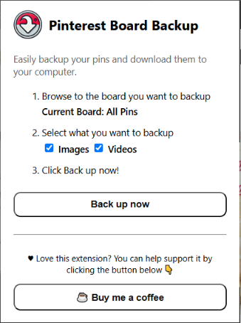

# Pinterest Board Backup

#### The Chrome Extension V1

---

Love this extension and want to contribute to future support and development?
All I can say is Thank you so much! You can contribute here:

---

Easily backup your pins on any Pinterest board locally to your computer and view them anytime.

Don't be worried about losing that board of dinner recipes you've been collecting for years.

## How it works

- The Pinterest Board Backup Chrome Extension will gather all the pins on your current board.
  - Please Note: You have to keep the tab open while the extension backs up your pins.
- Then, it will gather data from each pin such as the title, the pinnable image or video, description, the pin url, and any notes you've added.
- All this info is saved and downloaded to your PC in a nice tidy zip archive.

Included in the archive is a file called `viewer.html`. This file is an offline webpage that will allow you to easily view all the pins and their data.

## Installation

This extension will be available in the Chrome Web Store Soon(TM).

In the meanwhile, you can download this repo and add it to Chrome yourself by enabling `Developer Mode` on the `chrome://extensions/` page. Just click `Load unpacked` and select this extension's folder.

## How to Use it

Using the extension is simple, but there are some rules you must follow:

1. You must be logged in to Pinterest
2. You must be viewing a board
3. It will work best if you first refresh the page before clicking the 'Back up now' button.
4. Do not navigate away from the tab until the backup completes and your archive downloads.
5. Performance can vary depending on your internet speed and Pinterest rate limiting.

## Support

If you have any questions or support related issues, please open a `New Issue` here: https://github.com/eric-mathison/pinterest-board-backup/issues
